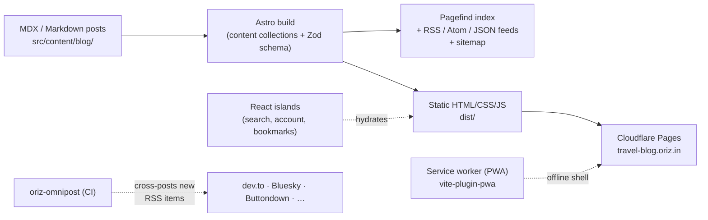

# Travel — `oriz-blog-travel`

> Field notes for Indian travellers — budget routes, solo-travel safety, and digital-nomad visas.

[](./LICENSE)
[](https://github.com/chirag127/oriz-blog-travel/stargazers)
[](https://github.com/chirag127/oriz-blog-travel/commits/main)
[](https://github.com/chirag127/oriz-blog-travel/actions/workflows/deploy.yml)
[](https://astro.build)

**Travel** is a static, content-first blog built with Astro and deployed to Cloudflare Pages.
A travel blog for budget, solo, and digital-nomad travellers from India — itineraries, visa notes, and on-the-road logistics, written to be practical rather than aspirational.

- **Live site:** https://travel-blog.oriz.in · **Repo:** https://github.com/chirag127/oriz-blog-travel
- **GitHub Pages landing:** https://chirag127.github.io/oriz-blog-travel/ — the canonical, always-current site is **https://travel-blog.oriz.in** (Cloudflare Pages); GitHub Pages is not the deploy target for this repo.

> ⭐ **If this is useful, please [star the repo](https://github.com/chirag127/oriz-blog-travel/stargazers)** — it helps others find it.

---

## Architecture



The content pipeline is deliberately boring: MDX in, typed and validated by a Zod schema, out to fully static HTML. Search runs client-side (Pagefind), a small set of React islands handle interactivity, and a service worker provides an offline shell. On `main`, CI builds and ships to the existing Cloudflare Pages project.

## Features

- **Content collections** — typed frontmatter (`title`, `description`, `pubDate`, plus tags, series, hero image, canonical URL) validated at build time.
- **Full-text search** — [Pagefind](https://pagefind.app), indexed at build, zero backend.
- **Feeds & SEO** — RSS, Atom, and JSON feeds; sitemap; robots.txt; per-post canonical URLs.
- **MDX + rich content** — GFM, math (KaTeX), and syntax highlighting via Expressive Code / Shiki.
- **PWA / offline** — service worker with an offline fallback and runtime caching.
- **Series & tags** — multi-part series navigation, tag and category archives.
- **Reader tools** — bookmarks, table-of-contents drawer, reading time, related posts.
- **Cross-posting** — new posts syndicate via `oriz-omnipost` in CI (dev.to, Bluesky, Buttondown, and more), keyed on RSS `<guid>` for idempotency.

## Tech stack

- **[Astro 6](https://astro.build)** — static output, content collections.
- **React 19** — hydrated islands only (search, account, bookmarks).
- **MDX** — `remark-gfm`, `remark-math` / `rehype-katex`, `rehype-slug`.
- **Tailwind CSS 4** (`@tailwindcss/vite`) for styling.
- **Pagefind** for search; **@astrojs/rss** + **@astrojs/sitemap** for feeds/SEO.
- **vite-plugin-pwa** / Workbox for the offline shell.
- **Biome** (lint/format), **Vitest** + **Playwright** (tests).
- **Cloudflare Pages** (host) via **Wrangler**; **pnpm** package manager.

## Repository structure

```
oriz-blog-travel/
├── src/
│   ├── content/blog/       # the travel guides (MDX/Markdown)
│   ├── content.config.ts   # Zod frontmatter schema for the `blog` collection
│   ├── pages/              # routes: index, blog, tags, series, feeds, search, legal
│   ├── layouts/            # page + post layouts
│   ├── components/         # Astro components + React islands (blog/, chrome/, embeds/)
│   ├── lib/                # helpers (feeds, reading time, search index)
│   ├── i18n/ · data/ · styles/
│   └── __tests__/          # Vitest smoke tests
├── astro.config.mjs        # site URL, integrations, PWA, redirects
├── .github/workflows/deploy.yml   # build → Cloudflare Pages
└── package.json
```

## Quick start

```bash
# Node >= 22.12
npm install --legacy-peer-deps   # CI uses this (the oz-ai file: dep resolves to a registry version)
npm run dev                      # local dev server
npm run build                    # static build → dist/
npm run preview                  # preview the production build
```

> Locally the repo uses **pnpm** (`pnpm install && pnpm build`); CI rewrites the local `@chirag127/oz-ai` `file:` dependency to its published version and installs with `npm install --legacy-peer-deps`. Either works.

Other scripts: `npm run typecheck` (astro check), `npm run lint` / `npm run format` (Biome), `npm test` (Vitest), `npm run test:e2e` (Playwright).

## Configuration

No secrets live in the repo. Deployment reads these from CI secrets / environment:

| Variable | Purpose |
| --- | --- |
| `CLOUDFLARE_API_TOKEN` | Deploy the built site to Cloudflare Pages (CI only). |
| `CLOUDFLARE_ACCOUNT_ID` | Target Cloudflare account for the Pages project (CI only). |
| `PUBLIC_BASE_PATH` | Optional base path for the Astro `base` (defaults to `/`). |

`PUBLIC_*` variables are client-safe by convention; everything sensitive stays in CI.

## Part of the oriz family

This is one site in the **oriz** network — ~26 topic blogs (travel, tech, health, food, gaming, finance, and more) sharing one Astro engine, plus dozens of other oriz apps and tools. Browse the hub at **[blog.oriz.in](https://blog.oriz.in)**.

- **$0 hosting** — runs entirely on the **Cloudflare Pages** free tier.
- **How it's built** — the fleet is generated and operated solo; see the "run 80 sites solo" and oriz-family architecture write-ups on [tech-blog.oriz.in](https://tech-blog.oriz.in).

## Contributing

Issues and PRs are welcome — typo fixes, factual corrections, and accessibility improvements especially. Keep changes small and focused.

## Status

Stable and continuously deployed. New posts ship regularly; **conventional commits are the changelog.**

## License

[MIT](./LICENSE) © Chirag Singhal · [chirag@oriz.in](mailto:chirag@oriz.in)
